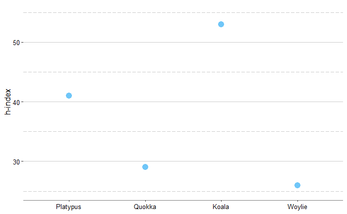
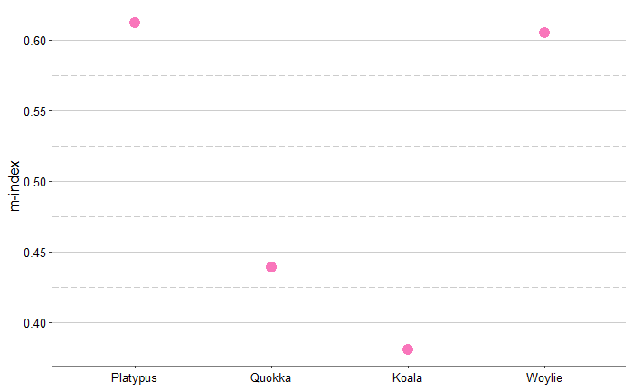

<br />

# Koala v. Woylie: research bias in Australasian marsupial species

- Duration: Jun - Aug 2019
- Tools used: R (tidyverse, bibliometrix)
- Supervisors: Shinichi Nakagawa, Malgorzata (Losia) Lagisz
- Grade: 90 WAM

This short study aimed to answer the question of whether there are any biases in the research on Australasian marsupials, and whether the amount and proportion of conservation-related studies match up with that of the endangered species. I explored time trends of the frequency of publications in different research areas. To find out if research efforts are being put into more ‘charismatic’ marsupial species, bibliometric analysis was performed for the comparison between the taxa in this study. The code and supplementary material are available on the [Open Science Framework](https://osf.io/f569v/).

## Results

Assessing the data on research output and proportions of endangered species in the four taxa, not much bias was found. Although Diprotodontia consisted of the most iconic Australian marsupials, it is also the largest order with the highest number and proportion of endangered species (Figure 1). However, most of the endangered or critically endangered species in this order are currently not very well-know and well-studied. Hence, although there were no biases between the taxa (Figure 2), species-level bias is rather prominent (Figure 3).

<br />
  


**FIGURE 1.** The number and proportion of Australasian marsupial species in each IUCN Red List category. Species categorised as ‘least concerned’ are in green, ‘near threatened’ in blue, ‘vulnerable’ in yellow, ‘endangered’ in orange and ‘critically endangered’ in pink.

<br />


**FIGURE 2.** The increase in the number of articles related to Diprotodontia, Dasyuromorphia, Peramelemorphia, and Notoryctemorphia from 1980 to 2019. Selected indexed keywords were used for the analyses of published articles.

<br />


**FIGURE 3.** The increase in the number of articles related to koala-related research and woylie-related research from 1980 to 2019. Selected indexed keywords were used for the analyses of published articles.

<br />

# R package: [specieshindex](https://github.com/jessicatytam/specieshindex)

specieshindex is a package that aims to gauge scientific influence of different species mainly using the h-index. The *h*-index is an impact factor traditionally used for academics. It is now available to rank and compare individual species.

-	Duration: Jun - Aug 2020 (with on-going updates)
-	Tools used: R (loops, conditionals, tidyverse, devtools), Adobe Photoshop
-	Supervisors: Shinichi Nakagawa, Malgorzata (Losia) Lagisz, Will Cornwell
- Grade: 92 WAM

Here is a quick example of how the get the citation records and calculate the indices.

```{r, eval=FALSE}
library(specieshindex)
# Extract citation data
Woylie <- FetchSpTAK("Bettongia", "penicillata", APIkey = API)
Quokka <- FetchSpTAK("Setonix", "brachyurus", APIkey = API)
Platypus <- FetchSpTAK("Ornithorhynchus", "anatinus", APIkey = API)
Koala <- FetchSpTAK("Phascolarctos", "cinereus", APIkey = API)
# Calculate indices
W <- Allindices(Woylie, genus = "Bettongia", species = "penicillata")
Q <- Allindices(Quokka, genus = "Setonix", species = "brachyurus")
P <- Allindices(Platypus, genus = "Ornithorhynchus", species = "anatinus")
K <- Allindices(Koala, genus = "Phascolarctos", species = "cinereus")
CombineSp <- rbind(W, Q, P, K) #combining the citation records
CombineSp
```
<br />

The code here will generate the following dataframe:

genus_species | species | genus | publications | citations | journals
--- | --- | --- | --- | --- | --- 
Bettongia_penicillata | penicillata | Bettongia | 113 | 1903 | 55
Setonix_brachyurus | brachyurus | Setonix | 242 | 3427 | 107
Ornithorhynchus_anatinus | anatinus | Ornithorhynchus | 321 | 6365 | 153
Phascolarctos_cinereus | cinereus | Phascolarctos | 773 | 14291 | 227

articles | reviews | years_publishing | h | m | i10 | h5
--- | --- | --- | --- | --- | --- | ---
110 | 3 | 44 |26 | 0.591 | 54 | 7
237 | 5 | 67 |29 | 0.433 | 121 | 3
308 | 13 | 68 |41 | 0.603 | 177 | 7
744 | 29 | 140 |53 | 0.379 | 427 | 13

## Example plots

```{r, eval=FALSE}
ggplot(CombineSp, aes(x = species,
                      y = h)) +
  geom_point(size = 4,
             colour = "#6fc6f8") +
  labs(x = "Species",
       y = "h-index") +
  scale_x_discrete(labels = c("Platypus", "Quokka", "Koala", "Woylie")) +
  ylim(25, 55) +
  theme(axis.title = element_text(size = 12,
                                  colour = "black"),
        axis.text = element_text(size = 10,
                                 colour = "black"),
        axis.line.x = element_line(colour = "grey50"),
        plot.background = element_rect(fill = "white"),
        panel.background = element_rect(fill = "white"),
        panel.grid.major.y = element_line(colour = "grey80"),
        panel.grid.minor.y = element_line(colour = "grey80",
                                          linetype = "longdash"),
        panel.grid.major.x = element_blank(),
        panel.grid.minor.x = element_blank(),
        legend.position = "none")
```

<br />



**FIGURE 4.** The *h*-index of the Woylie, Quokka, Platypus, and Koala.

```{r, eval=FALSE}
ggplot(CombineSp, aes(x = species,
                      y = citations)) +
  geom_point(size = 4,
             colour = "#f976bb") +
  labs(x = "Species",
       y = "Total citations") +
  scale_x_discrete(labels = c("Platypus", "Quokka", "Koala", "Woylie")) + 
  theme(axis.title = element_text(size = 12,
                                  colour = "black"),
        axis.text = element_text(size = 10,
                                 colour = "black"),
        axis.line.x = element_line(colour = "grey50"),
        plot.background = element_rect(fill = "white"),
        panel.background = element_rect(fill = "white"),
        panel.grid.major.y = element_line(colour = "grey80"),
        panel.grid.minor.y = element_line(colour = "grey80",
                                          linetype = "longdash"),
        panel.grid.major.x = element_blank(),
        panel.grid.minor.x = element_blank(),
        legend.position = "none")
```

<br />



**FIGURE 5.** The *m*-index of the Woylie, Quokka, Platypus, and Koala.

<br />

# Biases in research and public interests in mammalian publications

coming in August...